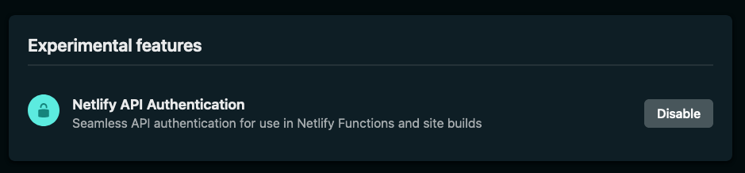
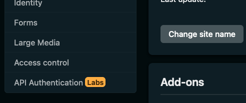
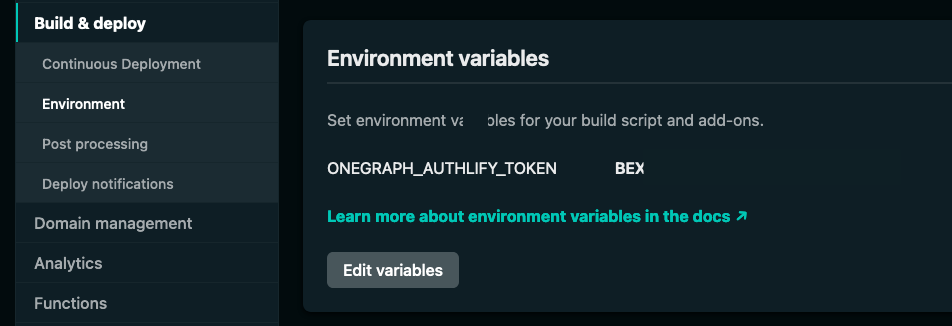
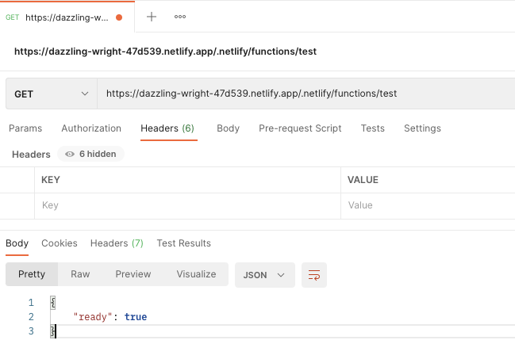

# API Authentication Documentation

> **NOTE:** API Authentication is a **Beta** feature released through [Netlify Labs](https://www.netlify.com/blog/2021/03/31/test-drive-netlify-beta-features-with-netlify-labs/). Its functionality is subject to change. We strongly recommend not using it in any production and/or critical workflows.

API Authentication is a new feature in Netlify that helps you simplify API authentication and token management. It enables you to remove the friction of having to re-write authentication code to connect to third-party APIs.

Once you connect to one of the API providers available in the Beta release, you can use the authentication tokens from those in your builds and [Netlify Functions](https://www.netlify.com/products/functions/). These tokens are securely stored and available as environment variables.

The API Authentication feature handles token refresh and scope management on your behalf, so you will not need to do anything extra to ensure that those work over time.

## Getting started

To get started, you will need to enable the feature in [Netlify Labs](https://app.netlify.com/user/labs). Once you open the Netlify Labs page, click on **Enable** next to the **Netlify API Authentication** experimental feature.



This action will automatically make the feature available for all sites in your Netlify team.

You can access the API Authentication feature by selecting your site from the team dashboard, and clicking on **API Authentication** in the sidebar.



From this tab, you can enable the feature for the selected site by clicking on **Enable API Authentication for `<site name>`**.

> **IMPORTANT:** Enabling API Authentication for a site will trigger a re-deploy of the site.

From this tab, you can also enable APIs that you would like to connect to. For a list of APIs available in the current release, refer to [Supported API Providers](#supported-api-providers).

When enabling an API authentication, you can define the access scopes that you'd like active for the automatically generated token. To define the scopes, click on the arrow next to the API provider name.


Once you have the scopes selected, click on the **Connect** button next to the relevant provider. This will kick off the authentication flow with the selected service.


> **IMPORTANT:** In the current release, you can only log in with your own credentials and can't proxy site visitor credentials (i.e., prompt the visitor of your website to log in with one of the providers).

Once you authenticate with an API provider, you will notice a new environment variable created for your site (you can view it in the **Environment variables** section in **Build & deploy** site settings tab).



This environment variable can be used to query available tokens inside your builds and functions. Refer to the [Examples](#examples) and [Full-size samples](#full-size-samples) sections to learn more about using the generated tokens.

Authentication tokens are specific for each individual site, so if you enable one of the API providers for one site, the token will not be re-usable on other sites. You need to authenticate with the same provider again if you would like to use it on a different site.

> **IMPORTANT:** The token generated for your site once you enable API Authentication gives direct access to all service tokens associated with the site. Ensure that only authorized parties are consuming it. Additional security measures are in development to reduce the Time To Live (TTL) for tokens accessible in builds and functions.

## Samples

You will need to use the [`@netlify/functions`](https://www.npmjs.com/package/@netlify/functions) package to access the API tokens.

In your Netlify function, you can access the secrets by using `NetlifySecrets` and `getSecrets`. using the `getSecrets` function will return a JSON blob that contains all token information that is associated with a given site.

### Basic secret handling

For example, if you authenticated with the Spotify API in the Netlify web interface, you can verify that you are logged in by using a code snippet such as this one:

```ts
import { Handler, getSecrets, NetlifySecrets } from "@sgrove/netlify-functions";

const handler: Handler = async (event, context) => {
  let secrets: NetlifySecrets = {};
  secrets = await getSecrets(event);

  if (secrets.spotify)
  {
    return {
      statusCode: 200,
      body: JSON.stringify({ready: secrets.spotify.isLoggedIn}),
    }
  }
  else
  {
    return {
      statusCode: 200,
      body: JSON.stringify({message: "Could not get Spotify information."}),
    }
  }
};

export { handler };
```

Assuming that you save the file as `checkStatus.ts` in [your functions directory](https://docs.netlify.com/functions/configure-and-deploy/#configure-the-functions-folder), you will be able to verify the results by sending a GET request to the URL:

```http
https://YOUR_SITE.netlify.app/.netlify/functions/checkStatus
```

You should get a result similar to this if you've authenticated with Spotify:



Stay tuned! More code samples coming shortly. 

## Supported API providers

For the Beta release, we support authenticating with the following providers:

- GitHub
- Salesforce
- Spotify
- Stripe
