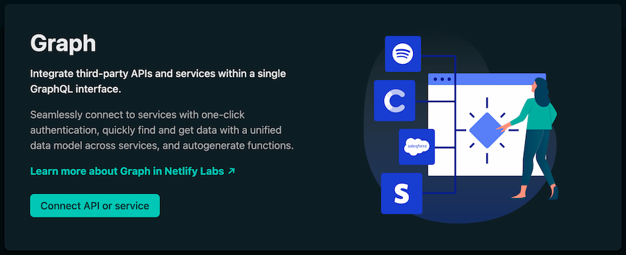

# Netlify Graph

> **NOTE:** Netlify Graph is a **Beta** feature released through [Netlify Labs](https://www.netlify.com/blog/2021/03/31/test-drive-netlify-beta-features-with-netlify-labs/). Its functionality is subject to change. We strongly recommend not using it in production or any critical workflows.

## Table of Contents
- [Overview](#overview)
- [Requirements](#requirements)
- [Example repo and tutorial](#example-repo-and-tutorial)
- [Get started with Netlify Graph](#get-started-with-netlify-graph)
- [Queries, mutatations, and subscriptions](#queries-mutations-and-subscriptions)
- [Access secrets with Netlify Graph](#access-secrets-with-netlify-graph)
- [Netlify Graph and Next.js](#netlify-graph-and-nextjs)
- [Feedback](#feedback)
- [Learn more](#learn-more)

## Overview

Netlify Graph enables developers to seamlessly integrate third-party APIs and services into their web applications without writing API-specific code. Instead of connecting different APIs and SDKs with brittle code, you can now abstract all that behind a convenient GraphQL interface.



Essentially, Netlify handles the messy integration work so you can focus on solving other problems.

Netlify Graph and its component features are available for all sites in your Netlify team by default.

## Requirements

Netlify Graph uses the Netlify CLI to communicate between your local project and your Netlify site. Before you do anything else, you should install the latest version of the Netlify CLI.

``` bash
npm install netlify-cli -g
```

## Example repo and tutorial

<!-- TODO: Update this section with link to the gravity repo -->
If you'd like to try Netlify Graph in a test project, check out the `gravity` sample repo. It has a full tutorial that walks you through getting the `gravity` site running on Netlify to creating and using GraphQL queries.

## Get started with Netlify Graph

  1. [Link your local project directory to your Netlify site](authentication.md#link-your-local-project-directory-to-your-netlify-site)
  2. [Connect to your first API or service](authentication.md#connect-to-your-first-api-or-service) in the Netlify UI.
  3. [Start a local CLI session with Netlify Dev](authentication.md#start-a-local-cli-session-with-netlify-dev).
  4. [Create a GraphQL query with Graph Explorer](authentication.md#create-a-graphql-query-with-graph-explorer).
  5. [Generate a query handler](authentication.md#generate-a-query-handler).
  6. [Use a query handler in your project](authentication.md#use-a-query-handler-in-your-project).

## Queries, mutations, and subscriptions

You use standard GraphQL queries, mutations, and subscriptions to interact with your Netlify Graph data.

- **[Queries](https://graphql.org/learn/queries/).** Are how you get data.
- **[Mutations](https://graphql.org/learn/queries/#mutations).** Are how you modify data. 
- **[Subscriptions](https://www.onegraph.com/docs/subscriptions.html).** Let you receive data in response to an event.

## Access secrets with Netlify Graph

You can access secrets for all of the APIs and services you connect to Netlify Graph. Check out the [Authentication docs](authentication.md#basic-secret-handling) for details.

## Netlify Graph and Next.js

If you are building a Next.js application, you can automatically generate Netlify Graph bindings by running the Netlify Graph commands inside your application folder.

> **NOTE**: Make sure to run the Netlify Graph commands in the root folder where your Next.js application is located. In the current CLI release, running in the root of the repository and not the application will result in an error.

## Disable Netlify Graph

Not interested in Netlify Graph? You can opt out by selecting your avatar in the top-right, then selecting Netlify Labs. Under **Experimental features**, find Netlify Graph and select **Disable**.

## Feedback

If you have thoughts to share and want to get in touch, [fill out our survey](https://ntl.fyi/apiauthsurvey).

## Learn More

- [Get started](get-started.md)
- [Graph Authentication](authentication.md)
- [Graph settings](graph-settings.md)