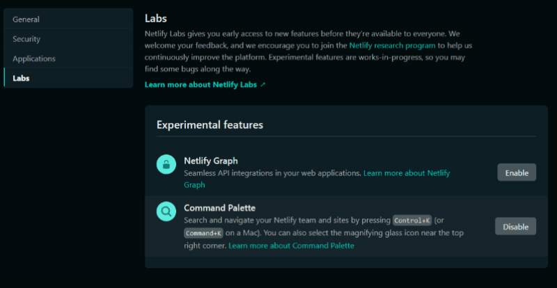
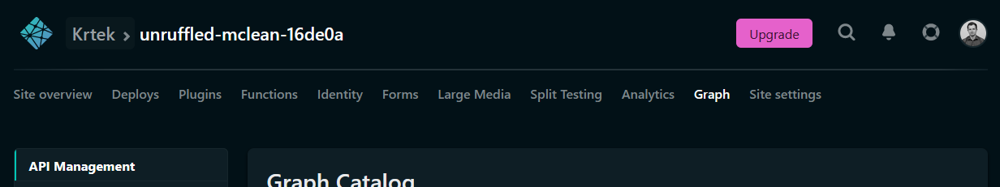

# Netlify Graph

## Table of Contents

- [Overview](#overview)
- [Enabling the feature](#enabling-the-feature)
- Components
- Feedback

## Overview

Netlify Graph is a new feature released through [Netlify Labs](https://www.netlify.com/blog/2021/03/31/test-drive-netlify-beta-features-with-netlify-labs/), that enables developers to seamlessly integrate third-party APIs in their web applications without having to write API-specific code.

We handle the messy integration work, and you can focus on solving interesting problems. Instead of connecting different APIs and SDKs with brittle code, you can now abstract all that out behind a convenient GraphQL interface.

## Enabling the feature

To enable Netlify Graph in your account, you need to use Netlify Labs, where you can click on **Enable** next to **Netlify Graph**.

Once enabled, you will notice a new **Graph** tab in the top navigation bar when you go to any of your sites on Netlify.

## Components

Netlify Graph in its current state has three core components, that you can learn more about by reading related documentation pages:

- API Management
- API Explorer
- [API Authentication](api-authentication.md)

## Feedback

If you have any feedback on the feature, make sure to [fill out our survey](https://ntl.fyi/apiauthsurvey).