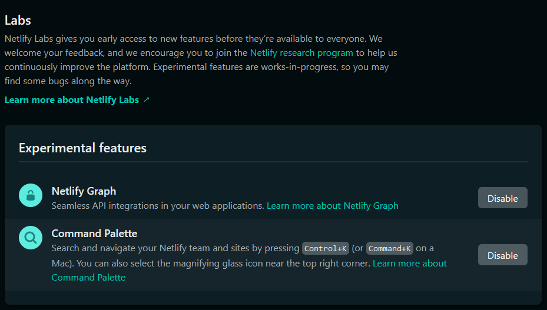
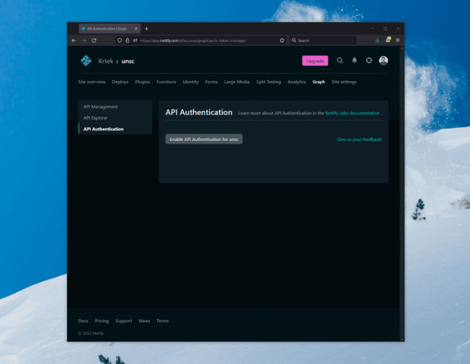
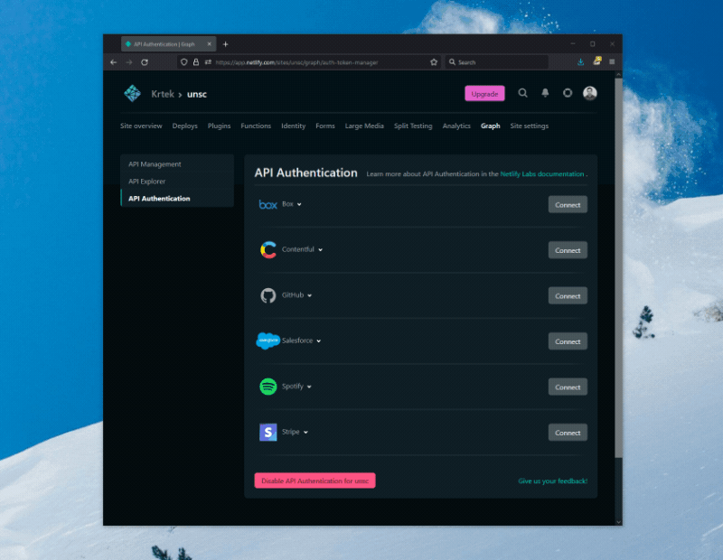

# API Authentication Documentation

> **NOTE:** API Authentication is a **Beta** feature released through [Netlify Labs](https://www.netlify.com/blog/2021/03/31/test-drive-netlify-beta-features-with-netlify-labs/). Its functionality is subject to change. We strongly recommend not using it in any production and/or critical workflows.

API Authentication is a a component of [Netlify Graph](README.md) that helps you simplify API authentication and token management. It enables you to remove the friction of having to re-write authentication code to connect to third-party APIs.

Once you connect to one of the API providers available in the Beta release, you can use the authentication tokens from those in your site builds and [Netlify Functions](https://www.netlify.com/products/functions/). These tokens are securely stored and available as environment variables.

The API Authentication feature handles token refresh and scope management on your behalf, so you will not need to do anything extra to ensure that those work over time.

## Getting started

To get started, you will need to enable the feature in [Netlify Labs](https://app.netlify.com/user/labs). Once you open the Netlify Labs page, click on **Enable** next to the **Netlify Graph** experimental feature.



This action will automatically make Netlify Graph and its component features available for all sites in your Netlify team.

You can access the API Authentication feature by selecting your site from the team dashboard, and clicking on **Graph** in the top navigation bar.


From this tab, you can enable the feature for the selected site by clicking on **API Authentication** in the sidebar, and then - **Enable API Authentication for `<site name>`**.

> **IMPORTANT:** Enabling API Authentication for a site will trigger a re-deploy of the site.

From this tab, you can also enable APIs that you would like to connect to. For a list of APIs available in the current release, refer to [Supported API Providers](#supported-api-providers).



When connecting to a service via API Authentication, you can define the access scopes that you'd like active for the automatically generated token. To define the scopes, click on the arrow next to the API provider name. Once you have the scopes selected, click on the **Connect** button next to the relevant provider. This will kick off the authentication flow with the selected service.



> **IMPORTANT:** In the current release, you can only log in with your own credentials and can't proxy site visitor credentials (i.e., prompt the visitor of your website to log in with one of the providers).

Once you authenticate with an API provider, you will notice a new environment variable created for your site (you can view it in the **Environment variables** section in **Build & deploy** site settings tab).


This environment variable is used to query available tokens inside your builds and functions. You don't need to use it directly, and can instead use the wrapper library. Refer to the [Samples](#samples) section to learn more about using the generated tokens.

Authentication tokens are specific for each individual site, so if you enable one of the API providers for a site, the token will not be re-usable on other sites in your team. You need to authenticate with the same provider again if you would like to use it on a different site.

> **IMPORTANT:** The `ONEGRAPH_AUTHLIFY_TOKEN` token generated for your site once you enable API Authentication gives direct access to all service tokens associated with the site. Ensure that only authorized parties are consuming it. Additional security measures are in development to reduce the Time To Live (TTL) for tokens accessible in builds and functions.

With services being authenticated, you no longer have to worry about OAuth flows for those, or chores such as token refresh - that is handled automatically by the API authentication service.

## Samples

You will need to use the [`@netlify/functions`](https://www.npmjs.com/package/@netlify/functions) package to access the API tokens.

In your Netlify function, you can access the secrets by using `NetlifySecrets` and `getSecrets`. using the `getSecrets` function will return a JSON blob that contains all token information that is associated with a given site.

### Basic secret handling

For example, if you authenticated with the Spotify API in the Netlify web interface, you can verify that you are logged in by using a code snippet such as this one:

```ts
import { Handler, getSecrets, NetlifySecrets } from "@netlify/functions";

const handler: Handler = async (event, context) => {
  let secrets: NetlifySecrets = {};
  secrets = await getSecrets(event);

  if (secrets.spotify)
  {
    return {
      statusCode: 200,
      body: JSON.stringify({ready: secrets.spotify.isLoggedIn}),
    }
  }
  else
  {
    return {
      statusCode: 200,
      body: JSON.stringify({message: "Could not get Spotify information."}),
    }
  }
};

export { handler };
```

In the example above, `secrets` becomes the all-encompassing JSON blob that contains tokens to every single service you've authenticated with in the Netlify web interface.

Assuming that you save the file as `checkStatus.ts` in [your functions directory](https://docs.netlify.com/functions/configure-and-deploy/#configure-the-functions-folder), you will be able to verify the results by sending a GET request to the URL:

```bash
https://YOUR_SITE.netlify.app/.netlify/functions/checkStatus
```

You should get a result similar to this if you've authenticated with Spotify:


You can get the bearer token by using the `<your_api_provider>.bearerToken` and pass it to the native SDK that you are using, such as the [Spotify web API wrapper](https://github.com/thelinmichael/spotify-web-api-node) or the [Octokit libraries](https://www.npmjs.com/package/octokit) from GitHub.

If you are interested in seeing an end-to-end demo solution that uses GitHub with API Authentication, refer to the [`gravity`](https://github.com/dend/gravity) sample.

## Supported API providers

For the Beta release, we support authenticating with the following providers:

- GitHub
- Salesforce
- Spotify
- Stripe
- Box
- Contentful

If you'd like to see more providers available, please [give us your feedback](#feedback).

## Feedback

If you have any feedback on the feature, make sure to [fill out our survey](https://ntl.fyi/apiauthsurvey).
