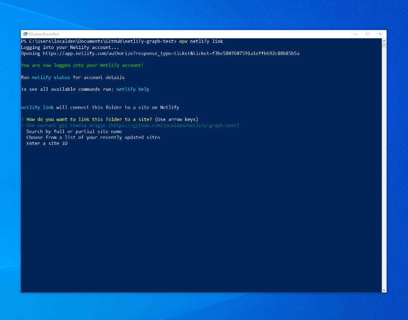
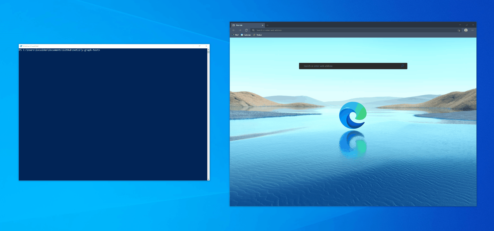
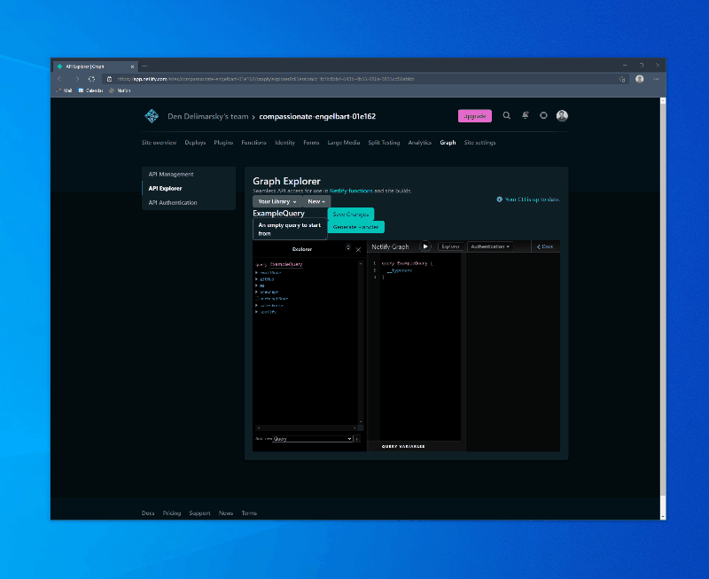

# Netlify Graph - API Explorer

The API Explorer experience in Netlify Graph allows you to construct queries against supported APIs and generate supporting code directly from the Netlify user interface.

To start experimenting with API Explorer, the easiest way to do it is by using one of our samples.

1. Use the `Deploy to Netlify` button on our test repository [https://github.com/sgrove/secrets-test](https://github.com/sgrove/secrets-test) to copy its contents into your own GitHub/GitLab account.
2. Check out your variant of the repository locally with the help of `git clone <YOUR_REPO_URL>`.
3. Navigate to the cloned folder in the Terminal: `cd <FOLDER_WHERE_YOU_CLONED_REPO>`.
4. Install `@sgrove/netlify-cli` (should be at least `8.6.24-beta.0`) by running `npm install @sgrove/netlify-cli` on your local computer. You must have [Node.js tooling](https://nodejs.org/en/download/) installed. This is the pre-release version of the Netlify CLI - you **cannot use the production version of the Netlify CLI** today to test the Netlify Graph functionality.
5. Run `npx netlify link` to run the Netlify CLI from the location where you installed the pre-release version of the Netlify CLI. This will prompt you to link your Netlify account to the current CLI session. Because you’ve already created a site based on the cloned repository when you used the **Deploy to Netlify** button, use the “*Use current git remote origin ([https://github.com/](https://github.com/localden/netlify-graph-test)<YOUR_REPO_URL>)***”** option in the CLI. If the command is successful, you will see the admin and site URLs shown in the terminal.



You are now ready to start experimenting with the Netlify Graph functionality. Run `npx netlify graph:edit` (you’ll need to log into the deploy preview site, so you may need to run this command twice). This will take you to the Netlify Graph API Explorer UI, where you will be able to compose new queries and mutations.

You are now ready to try different APIs. To start, you will need to enable the APIs that you want to work with in the [API Management](api-management.md) interface. Once you enable the desired APIs, you can use the Netlify CLI to start creating new Netlify Graph API interactions.

To get started, run the following command in the CLI, from within your repository folder:

```bash
npx netlify graph:edit
```



Running this command will automatically open the Netlify Graph API Explorer in your browser. To create a new query, click on **New +** and select **Query** - you can then use the **Explorer** button to open the list of available APIs and start composing query details.



Once you compose your query, you can save the changes by pressing **Save Changes**. This will queue up CLI updates. The changes you are making are isolated to your CLI session until you commit the generated content to the repository.

To get the latest persistent query updates in the CLI session and in your local copy, run:

```bash
npx netlify graph:pull
```

Another added benefit of using the API Explorer is that you can generate handlers for your queries. Handlers are auto-generated code that is packaged in Netlify Functions, that you can use from your web application. To generate a handler for your query, click **Generate Handler** in API Explorer, and then update your local copy by running:

```bash
npx netlify graph:pull
```
