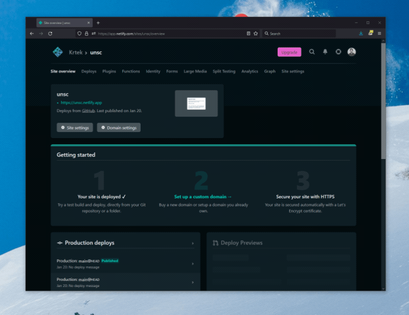

# Netlify Graph - API Management

The purpose of the API Management experience in Netlify Graph is to create a simple interface to define what APIs you want to use on your site. In its current implementation, this experience does not affect any API mechanism other than making the API available in the [API Explorer](api-explorer.md).

To enable or disable an API in API Explorer, go to **API Management** in the **Graph** tab and click **Connect** next to the service you'd like to see in the API Explorer interface.

Once the connection is successful, the service will appear in the API Explorer.