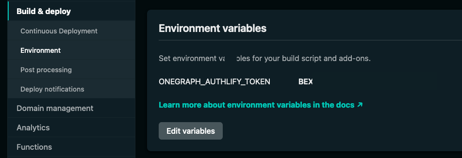
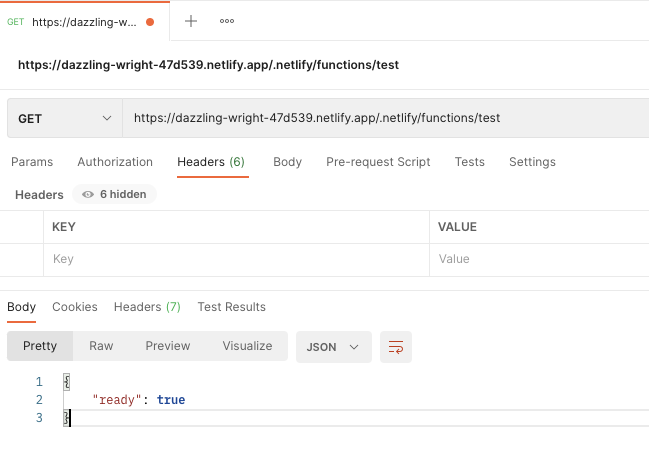

# Graph Authentication

Graph Authentication is the part of [Netlify Graph](README.md) that simplifies API authentication and token management. It removes the friction of re-writing authentication code to connect to third-party APIs.

<!-- QUESTION: Are tokens still stored as env vars? -->
When you connect to an API provider, you can use the authentication tokens from the provider in your site builds and [Netlify Functions](https://www.netlify.com/products/functions/). These tokens are securely stored and available as environment variables.

Graph Authentication handles token refresh and scope management on your behalf, so you will not need to do anything extra to ensure that those work over time.

## Access scopes

When connecting to an API or service with Graph Authentication, you can define scopes for the automatically-generated token. 

To define the scopes:
1. Select the arrow next to the API provider.
2. Choose your scopes, then select the **Connect** button. 
3. Follow the authentication flow for the selected API provider.

> **IMPORTANT:** In the current release, you can only log in with your own credentials and can't proxy site visitor credentials (For example: prompt the visitor of your website to log in with one of the providers).

## API token environment variable
<!-- QUESTION: Again, is this true? I haven't seen any env vars. -->
Authenticating with an API provider creates a new environment variable for your site. You can check it out at **Site settings > Build & deploy > Environment variables**.



This environment variable is used to query available tokens in your builds and Netlify Functions. You don't need to use it directly, and can instead use the wrapper library. Refer to the [Samples](#samples) section to learn more about using generated tokens.

Authentication tokens are specific to each site. If you enable an API provider for a site, you can't reuse the token on other sites in your team. You need to authenticate with the same provider again for every site.

<!-- TODO: Update this note based on response to env vars question. -->
> **IMPORTANT:** The `ONEGRAPH_AUTHLIFY_TOKEN` token generated for your site once you enable Graph Authentication gives direct access to all service tokens associated with the site. Ensure that only authorized parties are consuming it. Additional security measures are in development to reduce the Time To Live (TTL) for tokens accessible in builds and functions.

When services are authenticated, you don't have to worry about OAuth flows or token refresh for them. That is handled automatically by Graph Authentication.

## Basic secret handling

You need to use the [`@netlify/functions`](https://www.npmjs.com/package/@netlify/functions) package to access the API tokens.

In your Netlify Function, you can access secrets by using `NetlifySecrets` and `getSecrets()`. The `getSecrets()` function returns a JSON blob that contains all token information associated with a given site.

For example, if you authenticated with the Spotify API in the Netlify UI, you can verify that you are logged in by using a code snippet such as this one:

```ts
import { Handler, getSecrets, NetlifySecrets } from "@netlify/functions";

const handler: Handler = async (event, context) => {
  let secrets: NetlifySecrets = {};
  secrets = await getSecrets(event);

  if (secrets.spotify)
  {
    return {
      statusCode: 200,
      body: JSON.stringify({ready: secrets.spotify.isLoggedIn}),
    }
  }
  else
  {
    return {
      statusCode: 200,
      body: JSON.stringify({message: "Could not get Spotify information."}),
    }
  }
};

export { handler };
```

In the example above, `secrets` becomes the JSON blob that contains tokens to every service you've authenticated in the Netlify UI.

Assuming that you save the file as `checkStatus.ts` in [your functions directory](https://docs.netlify.com/functions/configure-and-deploy/#configure-the-functions-folder), you can verify the results by sending a GET request to this URL:

```bash
https://YOUR_SITE.netlify.app/.netlify/functions/checkStatus
```

You should get a result similar to this if you've authenticated with Spotify:



You can get the bearer token by passing `<your_api_provider>.bearerToken` to the native SDK you are using, such as the [Spotify web API wrapper](https://github.com/thelinmichael/spotify-web-api-node) or [Octokit libraries](https://www.npmjs.com/package/octokit) from GitHub.

If you are interested in seeing an end-to-end demo solution that uses GitHub with Graph Authentication, refer to the [`gravity`](https://github.com/dend/gravity) sample.

## Supported API providers

For the Beta release, we support authenticating with the following providers:

- GitHub
- Salesforce
- Spotify
- Stripe
- Box
- Contentful

If you'd like to see more providers available, please [send us your feedback](/README.md#feedback).

## Learn More

- [Docs home](README.md)
- [Get started](get-started.md)
- [Graph settings](graph-settings.md)
